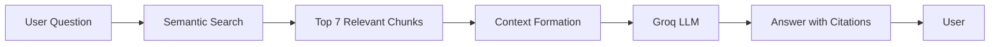

# RAGRathee 🎥🤖

<div align="center">


### 🔍 Ask questions about Dhruv Rathee's videos and get AI-powered answers with precise timestamps

[Demo](#) • [Features](#-features) • [Tech Stack](#-tech-stack) • [Deployment](#-deployment)

</div>

---

## ✨ Features

🔐 **Google OAuth Authentication** - Secure login with Google account

💬 **Intelligent Q&A System** - Ask questions and get contextual answers from video transcripts

🎯 **Precise Citations** - Every answer includes video titles, clickable URLs, and exact timestamps

📚 **Persistent Chat History** - Save and manage conversation history for each user

🔄 **Real-time Processing** - Instant semantic search powered by Sentence Transformers

🎨 **Modern UI** - Clean, responsive interface with smooth animations

---

## 🏗️ Tech Stack

<div align="center">

### Backend


### Frontend


### Authentication & APIs


### AI & ML


</div>

---

## 🎯 How It Works



1. **User asks a question** about Dhruv Rathee's video content
2. **Semantic search** finds the most relevant transcript chunks using embeddings
3. **Context is formed** from top 7 matching chunks
4. **Groq API (Llama 3.3)** generates a detailed answer
5. **Answer includes** video titles, URLs, and precise timestamps

---

## 📊 Dataset

- **Source**: Dhruv Rathee's Healthcare Playlist
- **Videos**: 12 videos
- **Chunking Strategy**: 30-second chunks with 5-second overlap
- **Embedding Model**: `sentence-transformers/all-MiniLM-L6-v2`
- **Storage**: Pre-computed embeddings in `embeddings.joblib`

---

## 🚀 Deployment

### Deployed on Render

[](https://render.com)

### Environment Variables

Create a `.env` file with:

```env
FLASK_SECRET_KEY=your-secret-key-here
GOOGLE_CLIENT_ID=your-google-client-id
GOOGLE_CLIENT_SECRET=your-google-client-secret
GROQ_API_KEY=your-groq-api-key
```

---

## 📸 Screenshots

<!-- Add screenshots here when ready -->
Coming soon...

---

## 🔑 Key Components

### RAG Pipeline
- **Retrieval**: Cosine similarity search on sentence embeddings
- **Augmentation**: Context window with top 7 relevant chunks
- **Generation**: llama-3.3-70b-versatile via Groq API with structured prompts

### Authentication
- OAuth 2.0 flow with Google
- Session-based user management
- Protected routes with `@login_required` decorator

### Frontend
- Vanilla JavaScript for dynamic interactions
- Chat interface with message history
- Real-time loading states and error handling

---

## 📝 API Endpoints

| Endpoint | Method | Description |
|----------|--------|-------------|
| `/login` | GET | Initiate Google OAuth login |
| `/authorize` | GET | OAuth callback handler |
| `/logout` | GET | Clear session and logout |
| `/api/user` | GET | Get current user info |
| `/query` | POST | Ask a question |
| `/chats` | GET | Get user's chat history |
| `/chats` | POST | Save chat history |

---

## 🎨 UI Features

- **Responsive Design** - Works on desktop, tablet, and mobile
- **Dark Mode** - Easy on the eyes
- **Smooth Animations** - Modern micro-interactions
- **Loading States** - Visual feedback during processing
- **Example Prompts** - Quick-start suggestions
- **Chat Management** - Rename, delete, and share conversations

---

## 🤝 Contributing

Contributions are welcome! Feel free to open issues or submit pull requests.

---

## 📄 License

This project is licensed under the MIT License - see the [LICENSE](LICENSE) file for details.

---

## 🙏 Acknowledgments

- **Dhruv Rathee** for educational video content
- **Groq** for fast LLM inference
- **Sentence Transformers** for semantic search capabilities
- **Google** for OAuth authentication

---

<div align="center">

Made with ❤️ by Harshal Nikumbh

[](https://github.com/harshalnikumbh305)
[](https://www.linkedin.com/in/harshalravindranikumbh)

**⭐ Star this repo if you find it useful!**

</div>
